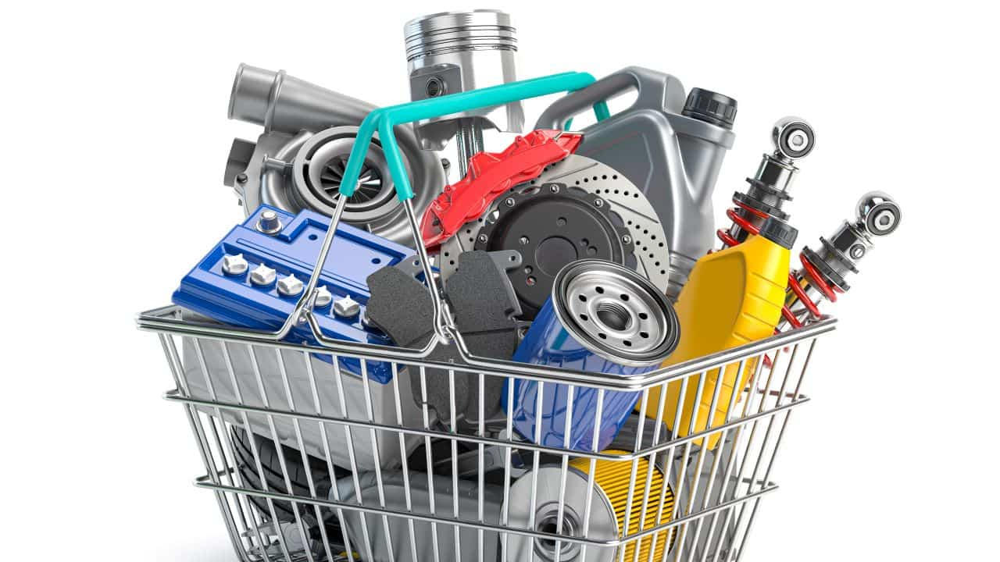

# Comprar peças

Explorar nossa vasta seleção de peças automotivas é fácil e intuitivo. Nossa equipa especializada está pronta para ajudá-lo a encontrar exatamente o que você precisa, seja para manutenção regular, reparos ou melhorias personalizadas. Oferecemos peças genuínas de alta qualidade, garantindo a compatibilidade perfeita com o seu veículo.

# Qualidade no serviço

Além da qualidade das peças, comprometemo-nos a fornecer um serviço amigável e eficiente. Nossa equipa está disponível para oferecer orientação técnica, responder a perguntas e garantir que você faça escolhas informadas ao comprar suas peças.

# Stock de peças

Aqui está o nosso stock de peças, atualizado sempre que necessário!

| Peças                | Marca            | Preço (em euros) |
| -------------------- | ---------------  | -----------------|
| Farol dianteiro      | Luminar          | 150,00           |
| Pastilhas de travagem   | BrakeMaster      | 30,00            |
| Filtro de óleo       | CleanFlow        | 10,00            |
| Bateria              | PowerCharge      | 80,00            |
| Espelho retrovisor   | ReflectPro       | 50,00            |
| Amortecedor dianteiro | SmoothRide      | 120,00           |
| Disco de travagem      | StopTech         | 40,00            |
| Correia dentada      | DriveMaster      | 25,00            |
| Filtro de ar         | AirPure          | 15,00            |
| Alternador           | PowerGen         | 100,00           |
| Vela de ignição      | SparkPro         | 8,00             |
| Radiador             | CoolFlow         | 70,00            |
| Sensor de oxigénio   | OxySense         | 35,00            |
| Palheta do limpador  | ClearView        | 12,00            |
| Kit de embreagem     | ClutchMaster     | 200,00           |
